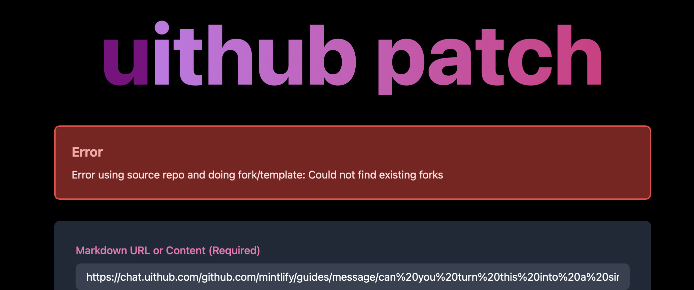

✅ Use `join.forgithub.com` but with a `nachocache` in front. Just details for now

✅ `/owner/grid.html` Renders ag-grid which just loads from `/dashboard.json` via frontend

✅ Allow viewing someone elses dashboard too (public only)

Make OpenAPI that documents the use of `dashboard.json` and `dashboard.md`

## Stars tab

All repos you've starred should show up here. If the user has lists, the lists should be categories, since if it's listed, it's also starred. If there's no particular list for something, just put in general.

Later it'd be great if an AI can automatically fill the lists every hour if there are new/changed lists or new repos. KILLER FEATURE FOR GITHUB.

## `/owner/dashboard.json` (2025-01-31)

Improve `dashboard.forgithub.com/dashboard.json`:

- Returns KV value immediately (or loads if not yet or `?refresh=true`)
- Calls `waitUntil` that calls queue to fetch from `join` if KV >1h old or if there was a `?refresh=true`
- Has README.md, CHANGELOG.md, SPEC.md, TODO.md, ADR.md, size, and openapiSummary
- Has `context: {id:string,title:string,url:string,description:string}[]` which can be used for chat (redirect to `chat.uithub.com?context=https://dashboard.uithub.com/dashboard.json&id=xxx`)

Does this just for all repos from the last 30 days (for now) to prevent ratelimit trouble.

## githubwatch

❗️ We need a way to nicely request and store an access_token for watching from the dashboard.

1. Actually subscribe to watching all repos upon login (via a waituntil+scheduled api call).
2. Ensure per user I know the source (where/when they logged in)
3. Ensure the watching all lands in cache
4. Watch also triggers calculating all repo stuff, so we end up with a file of all repos + calcs that is refreshed each time something changes. 🐐

## `/[owner]/dashboard.md?focus=[datapoint]`

✅ Write simple function that just nicely renders it as markdown.

If focus is provided, will also show one of the long datapoints (README.md and other pages)

Be sure to do one more iteration on chat (nav and some bugs) - then ask people to test to use this - and then prepare a 'announching uithub chat' post.

## `/[owner]/dashboard.html` UI

- ✅ link to show raw data
- ✅ clear buttons linking to useful things like uithub, github, website, forgithub (other tools)
- at the top, select what to view in the right pane
- at the top, add search that matches on full_name
- show repo card with screenshot on the left, pane at the right that renders a datapoint such as README.md, CHANGELOG.md, SPEC.md, TODO.md, ADR.md, size, and openapiSummary

## https://cf.uithub.com/[owner]

We need to use the same datapoint but render a more exploration friendly dashboard intended to understand what someone does. Can use the same `dashboard.json/md` api!

# Patch error

Fork not working:

https://patch.uithub.com/prepare?markdown=https%3A%2F%2Fchat.uithub.com%2Fgithub.com%2Fmintlify%2Fguides%2Fmessage%2Fcan%2520you%2520turn%2520this%2520into%2520a%2520single%2520markdown%2520guide%2520comprising%2520all%2520of%2520the%2520pages%253F%2Fmodel%2Fclaude-3-5-sonnet-latest%2Fcontent.md&sourceOwner=mintlify&sourceRepo=guides&sourceBranch=main&targetBranch=main

# Queue improvements

After push:

- call for https://diagram.forgithub.com/owner/repo/image.png?max-age=0
- call for https://size.forgithub.com/owner/repo

After deployment (1 minute after)

- call for https://quickog.com/screenshot/{url} (only insert if 200)

# Dashboard

✅ Diagram: add max-age!

Render size, screenshot, and diagram if available.
